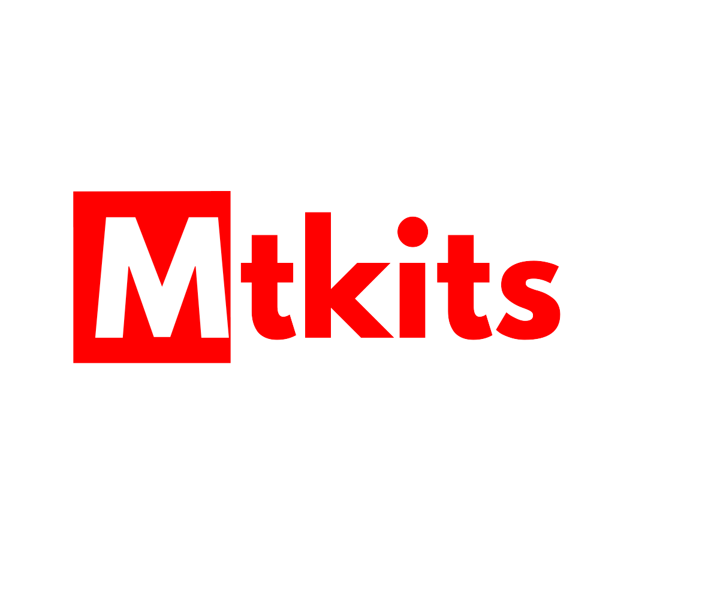

# **[MTKITS - VERSION 2](https://mtkits.evenafro.ca)**

Bienvenue sur le fichier README de MTKits, un projet privé développé par
[`Brain4Code`](public/images/b4c.png)
avec Laravel 10 pour le client [`MtKits`](public/images/logo.png). Ce projet intègre des technologies
modernes pour fournir une expérience utilisateur optimale et une gestion administrative efficace.

## **TECHNOLOGIES UTILISÉES**

- **Laravel 10** : La dernière version du framework PHP, offrant une architecture robuste pour le développement
  d'applications web.
- **Tailwind CSS** : Un framework CSS utilitaire first pour un design personnalisé rapide et réactif.
- **FilamentPHP** : La dernière version de l'outil d'administration pour Laravel, permettant de créer des interfaces
  d'administration riches et intuitives.

## **PRÉREQUIS**

- PHP ^8.2
- [Laravel 10.x](https://laravel.com/10.x)
- [Composer](https://getcomposer.org)
- [Node.js et npm (pour Tailwind CSS)](https://tailwindcss.com)

## **INSTALLATION**

1. Clonez le dépôt Git : <a href="https://gitlab.com/brain4code/mtkits.git">Cliquez ici</a>
2. Installez les dépendances PHP avec Composer :

```bash
composer install
```

3. Installez les dépendances npm pour Tailwind CSS :

```bash
npm install
```

4. Copiez le fichier `.env.example` en `.env` et configurez vos variables d'environnement :

```bash
cp .env.example .env
```

5. Générez une clé d'application :

```bash
php artisan key:generate
```

## **UTILISATION**

Pour démarrer le serveur de développement sur le port 80, exécutez :

```bash
php artisan serve --port=80
```

## **Licence**

Distribué sous la licence `EULA`. Voir `LICENSE` pour plus d'informations.

## **CONTRIBUTEURS**

**[JIORDI KENGNE](https://wa.me/237682786315)** - **DARWIN FOTSO** - **AARON MANDJECK**

Lien du Projet : https://gitlab.com/brain4code/MTKits.git
